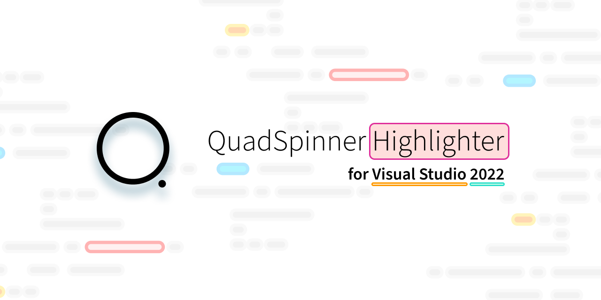
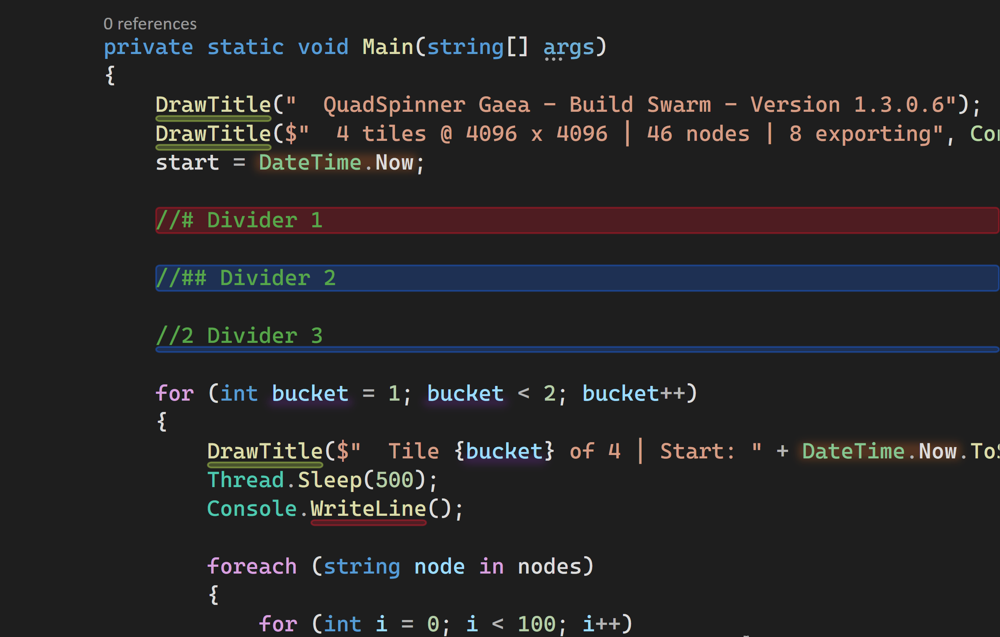
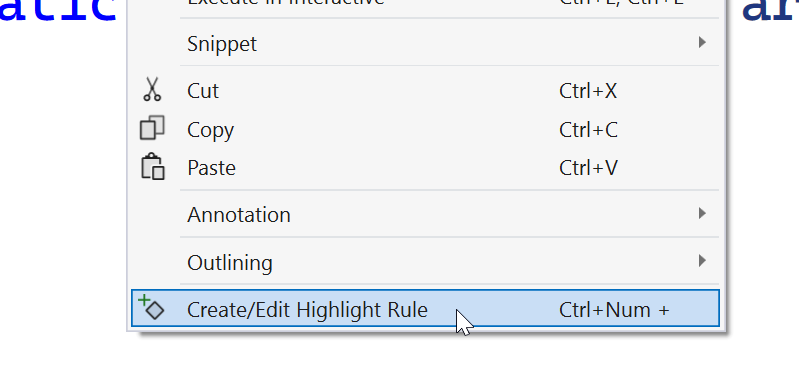
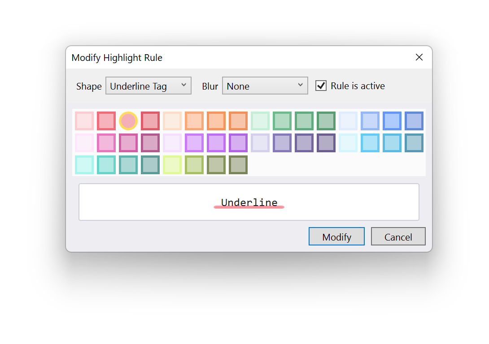
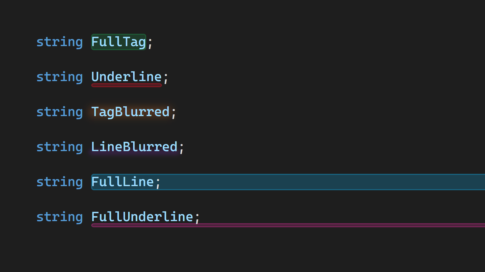
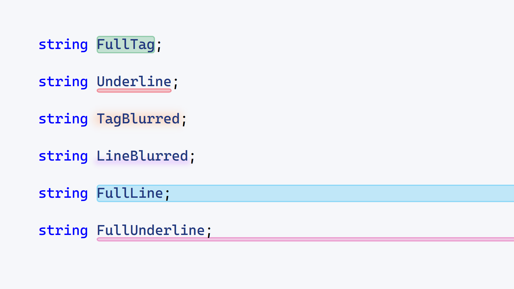
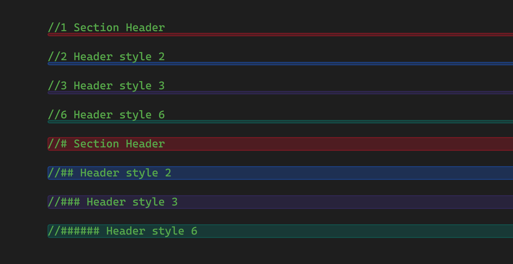
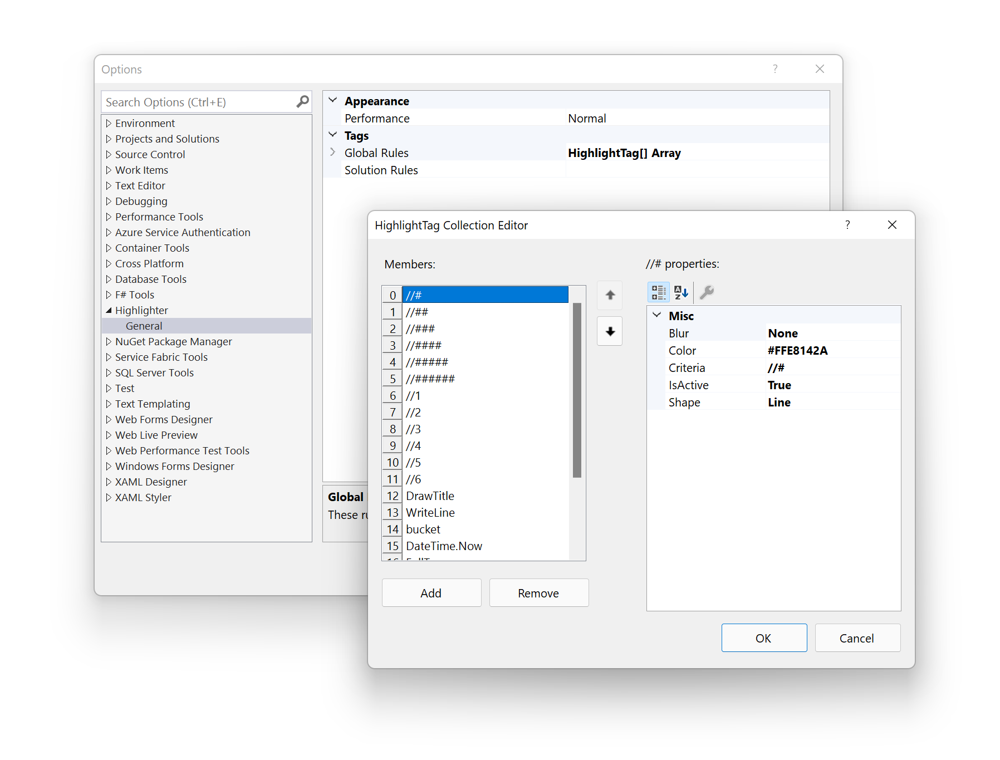

# QuadSpinner Highlighter for Visual Studio 2022

An arbitrary highlighter that lets you pick individual class, parameter, or other element names to highlight across your projects. It makes it easier to find and identify objects inside your project. You can also use it for comment annotations, dividers, and more.

**You can pick any word. Highlighter does not care about its meaning to the programming language, just what is on the screen.**

## Creating Highlights

To create a highlight, select the desired word or phrase and press `Ctrl` + `Keypad Plus`. Or you can right-click the selection and click `Create/Edit Highlight`.

If the selection is an existing highlight, then you will be able to edit it. If it is a new one, you get to define its shape.

You can choose the tag shape, optional blur, and color. The Highlight Editor window shows you a preview to help you choose the right shape.

## Highlight Shapes

## Dividers

Highlighter ships with 12 divider highlight rules.

## Options

