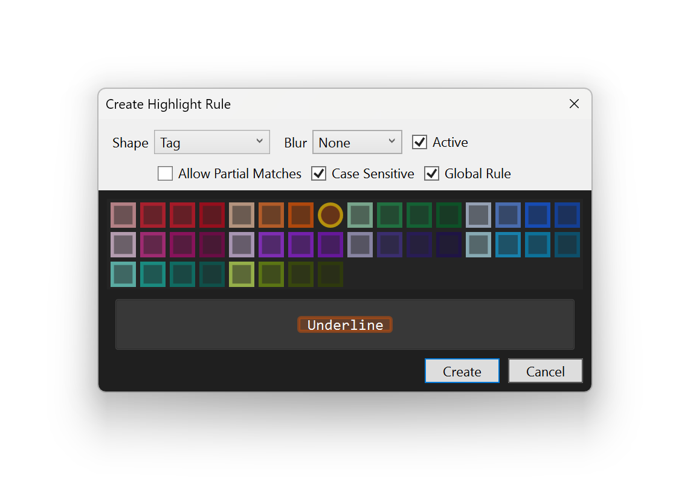

# QuadSpinner Highlighter for Visual Studio 2022

An arbitrary highlighter that lets you pick individual class, parameter, or other element names to highlight across your projects. It makes it easier to find and identify objects inside your project. You can also use it for comment annotations, dividers, and more.

Free download on [Visual Studio Marketplace](https://marketplace.visualstudio.com/items?itemName=DaxPandhi.Highlighter1)

**Features**
- Highlight any arbitrary term
- 4 different highlight shapes
- Solution-scoped rules (Source control friendly)
- Case sensitive and partial matches
- Toggle highlights easily
- Performant even on older machines and VMs

> Requires Visual Studio 2022 Community Edition or higher. It should work in all text editor surfaces.

**You can pick any word. Highlighter does not care about its meaning to the programming language, just what is on the screen.**

## Creating Highlights

To create a highlight, select the desired word or phrase and press `Ctrl + Num Plus`. Or you can right-click the selection and click `Create/Edit Highlight`.

If the selection is an existing highlight, then you will be able to edit it. If it is a new one, you get to define its shape.

You can choose the tag shape, optional blur, and color. The Highlight Editor window shows you a preview to help you choose the right shape. You can also choose whether to allow partial matches or toggle case sensitivity.

The `Global Rule` option allows you to declare a rule globally across all solutions. Unchecking the option creates a rule scoped to the current solution and made portable for transport. Such rules are stored in the `~\.vs\Highlights.xml` and can be checked into source control for easy sharing.

For an existing rule, you can also uncheck "Rule is Active" to disable the rule without deleting it, or select Delete to remove the permanently.

## Highlight Shapes

Highlighter can create 4 different shapes, 4 option blur levels, using 40 different colors. You can also enter a hex value manually in the Options. These colors are chosen specifically to give you decent visibility whether using a dark or light theme.

There are 12 built in rules for creating dividers. `//1` through `//6` and `//#` through `//######` create full line dividers. You modify these rules or make your own.

| Dark | Light|
| --- | --- |
|  |  | 
|  |  |

## Options

The Options let you edit the rules en mass, as well as use color values not in the default palette. You can delete highlights here.

---

### Contributors

@bartosz-jarmuz 
